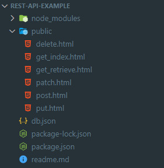
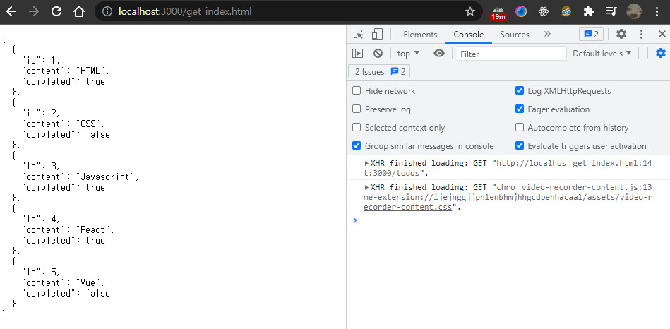

### Introduction

자바스크립트 Deep Dive(이웅모, 위키북스) 책의 44장 REST API 실습코드를 저장한 레포지토리입니다.

### 과정

- JSON Server 설치
- db.json 파일 생성
- JSON Server 실행
- GET, POST, PUT, PATCH, DELETE 요청

### 디렉터리 구조



###  실행방법

```
$npm install
$npm start
```

localhost:3000 으로 JSON Server에 접속

### 예시

주소창에 localhost:3000/get_index.html 을 입력하면 

아래 코드와 같이 자바스크립트 코드가 실행되며 

todos 리소스에서 모든 todo를 가져온다. (db.json에 저장된 모든 데이터)

```html
<!DOCTYPE html>
<html>
  <body>
    <pre></pre>
    <script>
      // XMLHttpRequest 객체 생성
      const xhr = new XMLHttpRequest();

      // HTTP 요청 초기화
      // todos 리소스에서 모든 todo를 취득(index)
      xhr.open("GET", "/todos");

      // HTTP 요청 전송
      xhr.send();

      // load 이벤트는 요청이 성공적으로 완료된 경우 발생한다.
      xhr.onload = () => {
        // status 프로퍼티 값이 200이면 정상적으로 응답된 상태다.
        if (xhr.status === 200) {
          document.querySelector("pre").textContent = xhr.response;
        } else {
          console.error("Error", xhr.status, xhr.statusText);
        }
      };
    </script>
  </body>
</html>

```



